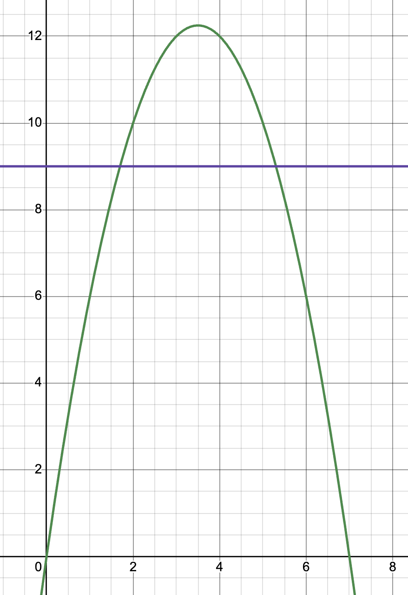

# Day 6

## Part 1

This puzzle is about racing toy boats. Instead of how races usually go, i.e.
fixed distance, winner is the one that finishes in the shortest time, this is
reversed. The winner is the one that goes the furthest in a fixed amount of
time. The boats travel at a speed equal to the number of seconds its "charge"
button is held, and hold time is part of the time limit. You can express it as a function of button hold time vs distance
traveled in the time limit like this: distance traveled = hold time * (time
limit - hold time) or:

$$y = x(t - x) = -x^2 + xt$$

The distance record function is a constant: $$y = d$$

Combining them:

$$y = -x^2 + xt = d$$

$$-x^2 + xt - d = 0$$

Now we can solve the quadratic function to find out how long the button could
have been held to achieve these distances:

$$x=\frac{t±\sqrt{t^2-4d}}{2}$$

In the first example race, the time limit was 7, and the distance record to beat
was 9. Plugging those values in for $t$ and $d$ respectively gives us:

$$x=\frac{7±\sqrt{12}}{2}≈(1.6,5.3)$$

Then, we count the number of whole numbers between them: (2, 3, 4, 5) giving us
the correct answer 4. The only way I could figure out how to get that count is
with a for loop, but I feel there's probably a better way.

My first answer was wrong because I was only looking at the first decimal place
when getting the whole number count. I increased the precision to something like
ten decimal places and got the right answer.

## Part 2

However, because Part 2 is the same as Part 1, just with larger numbers, all
those decimal places were making it take too long. So I tried splitting the
difference, just two decimal places was enough to get the right number for Part
1, and made Part 2 not take too long.
