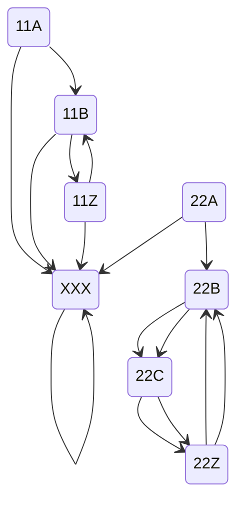

# Day 8

Graph traversal!

## Part 1

I suppose I could solve this part just with a `map[string][]string` but I wanted more experience with pointers because I am still guessing when I need a `*` versus an `&`.

## Part 2

I've been stuck on this for a few days. Brute force won't work, could take upwards of multiple years. I think the first step is to find the cycles. This is a visual representation of the graph in the example in part 2:

There would be two ghosts, one starting on `11A`, the other on `22A`. They would take the following paths:

| Step | Ghost 1 | Ghost 2 |
| ---- | ------- | ------- |
| 0    | 11A     | 22A     |
| 1    | 11B     | 22B     |
| 2    | **11Z** | 22C     |
| 3    | 11B     | **22Z** |
| 4    | **11Z** | 22B     |
| 5    | 11B     | 22C     |
| 6    | **11Z** | **22Z** |

We are trying to find how many steps it takes for all ghosts to be on a node that ends with `Z`. The answer here would be `6`. The answer is probably going to be in or around the trillions, so we have to solve the problem mathematically. Maybe a formula for each ghost? e.g. ghost 1 is on a `Z` like this: $y = 2x_1$ and ghost 2: $y = 3x_2$ where $x_n$ is the sequence of `Z` nodes and $y$ is the step on which that `Z` falls. So if we want to find where both ghosts are on a `Z`,

$$2x_1 = 3x_2$$

$$\frac{x_1}{x_2}= \frac{3}{2}$$

$$x_1 = 2$$

$$y=2*3=6$$

LCM of 10 15

$5*2=10$

$3*5=15$

$5 * 2 * 3 = 30$

24, 30

$12*2=2*2*2*3$

$15*2=2*3*5$

$2*2*2*3*5=24*5=120$