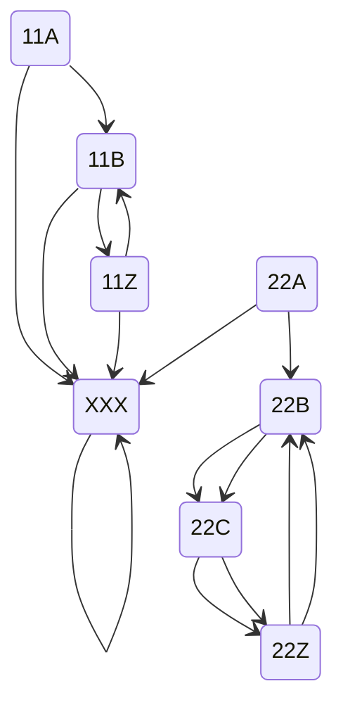

# Day 8

Graph traversal!

## Part 1

I suppose I could solve this part just with a `map[string][]string` but I wanted more experience with pointers because I am still guessing when I need a `*` versus an `&`.

## Part 2

I've been stuck on this for a few days. Brute force won't work, could take upwards of multiple years. I think the first step is to find the cycles. This is a visual representation of the graph in the example in part 2:

There would be two ghosts, one starting on `11A`, the other on `22A`. They would take the following paths:

| Step | Ghost 1 | Ghost 2 |
| ---- | ------- | ------- |
| 0    | 11A     | 22A     |
| 1    | 11B     | 22B     |
| 2    | **11Z** | 22C     |
| 3    | 11B     | **22Z** |
| 4    | **11Z** | 22B     |
| 5    | 11B     | 22C     |
| 6    | **11Z** | **22Z** |

We are trying to find how many steps it takes for all ghosts to be on a node that ends with `Z`. The answer here would be `6`. The answer is probably going to be in or around the trillions, so we have to solve the problem mathematically. I wrote some code just to show the nature of the data, looks like it's not as bad as it could be:

* There are six ghosts (i.e. six nodes that end with `A`)
* Amongst the nodes they cross, each only crosses one `Z` node
* They always cross their `Z` node at the same interval, which is also the step number on which they first cross their `Z` node

| Start Node | Z Node | Step of First Crossing |
| ---------- | ------ | ---------------------- |
| TTA        | KHZ    | 15871                  |
| LTA        | DXZ    | 21251                  |
| BGA        | HSZ    | 12643                  |
| AAA        | ZZZ    | 14257                  |
| NJA        | HRZ    | 19099                  |
| KJA        | KRZ    | 19637                  |

So I would guess the answer is the least common multiple of all the numbers in the left column, no?